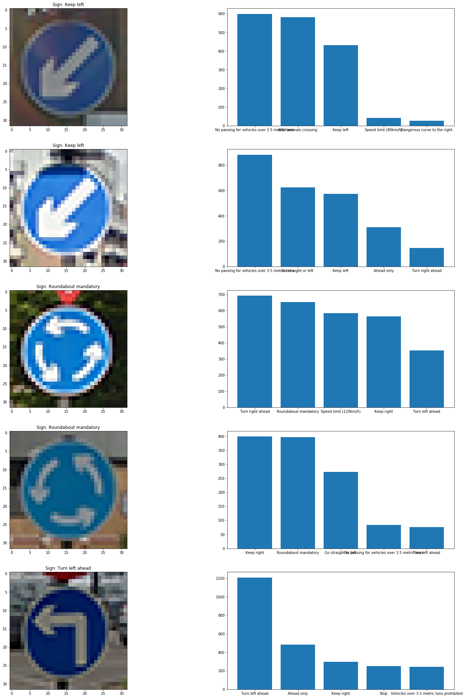

#**Traffic Sign Recognition** 

##Writeup Template

###You can use this file as a template for your writeup if you want to submit it as a markdown file, but feel free to use some other method and submit a pdf if you prefer.

---

**Build a Traffic Sign Recognition Project**

The goals / steps of this project are the following:
* Load the data set (see below for links to the project data set)
* Explore, summarize and visualize the data set
* Design, train and test a model architecture
* Use the model to make predictions on new images
* Analyze the softmax probabilities of the new images
* Summarize the results with a written report

## Rubric Points
###Here I will consider the [rubric points](https://review.udacity.com/#!/rubrics/481/view) individually and describe how I addressed each point in my implementation.  

---
###Writeup / README

####1. Provide a Writeup / README that includes all the rubric points and how you addressed each one. You can submit your writeup as markdown or pdf. You can use this template as a guide for writing the report. The submission includes the project code.

Here is a link to my [project code](https://github.com/chappers/CarND-Traffic-Sign-Classifier-Project/blob/master/Traffic_Sign_Classifier_FINAL.ipynb)

###Data Set Summary & Exploration

####1. Provide a basic summary of the data set. In the code, the analysis should be done using python, numpy and/or pandas methods rather than hardcoding results manually.

I used the pandas library to calculate summary statistics of the traffic
signs data set:

* The size of training set is 34799
* The size of the validation set is 4410
* The size of test set is 12630
* The shape of a traffic sign image is `(32, 32, 3)`
* The number of unique classes/labels in the data set is 43

####2. Include an exploratory visualization of the dataset.

Here is an exploratory visualization of the data set. It is a bar chart showing the distribution of the labels across the dataset. From here we can see that it is clearly an unbalanced learning problem, which means, we might be able to get some training improvement by adding additional training samples for the classes which are not as well represented. 

![label histogram][barchart.png]

###Design and Test a Model Architecture

####1. Describe how you preprocessed the image data. What techniques were chosen and why did you choose these techniques? Consider including images showing the output of each preprocessing technique. Pre-processing refers to techniques such as converting to grayscale, normalization, etc. (OPTIONAL: As described in the "Stand Out Suggestions" part of the rubric, if you generated additional data for training, describe why you decided to generate additional data, how you generated the data, and provide example images of the additional data. Then describe the characteristics of the augmented training set like number of images in the set, number of images for each class, etc.)

As the LeNet implementation used grayscale, I decided to modify it to take non-grayscale features, as the colour of the sign is probably close to the classification (e.g. no entry is red, other signs are blue etc.)

Two preprocessing steps were used to help with the colours, the first one was to use histogram equalization, as an attempt to improve the contrast for all images. ([See here for OpenCV function](http://docs.opencv.org/3.1.0/d5/daf/tutorial_py_histogram_equalization.html)

Afterwards we standardised our whole dataset using scikit-learn standard scalar.

Finally to generate new samples and make the problem more "balanced" we created synthetic examples via randomly rotating and transforming the image (rotations, shearing and translations). 

![sample transforms][sample_transforms.png]

####2. Describe what your final model architecture looks like including model type, layers, layer sizes, connectivity, etc.) Consider including a diagram and/or table describing the final model.

My final model consisted of the following layers (using LeNet):

*  Layer 1: Convolutional. Input = 32x32x3. Output = 28x28x6
*  Activation: RELU
*  Max Pooling. Input = 28x28x6. Output = 14x14x6.
*  Layer 2: Convolutional. Output = 10x10x16.
*  Activation: RELU
*  Max Pooling. Input = 10x10x16. Output = 5x5x16.
*  Flatten. Input = 5x5x16. Output = 400.
*  Layer 3: Fully Connected. Input = 400. Output = 120.
*  Activation: RELU
*  Layer 4: Fully Connected. Input = 120. Output = 84.
*  Activation: RELU
*  Layer 5: Fully Connected. Input = 84. Output = 43.

####3. Describe how you trained your model. The discussion can include the type of optimizer, the batch size, number of epochs and any hyperparameters such as learning rate.

We used exponential decay for the learning rate which is updated on each step using the equation:

$$learning_rate := learning_rate * decay$$

We used the initial learning rate to be 0.001, and the decay to be 0.9. 

In addition to this, I played around with dropout as a way to regularise our neural network. Initially I used drop out on all layers, but defaulted to only the final layer, due to the massive increase in time required to train. This helped bring the training and validation datasets to have a closer score. 

I found increasing EPOCH didn't do much except increase frustration, so I left it relatively low (10) so that I could iteratively improve other parts of the process, which were far more effective. 

All other options to be the same as LeNet. 

####4. Describe the approach taken for finding a solution and getting the validation set accuracy to be at least 0.93. Include in the discussion the results on the training, validation and test sets and where in the code these were calculated. Your approach may have been an iterative process, in which case, outline the steps you took to get to the final solution and why you chose those steps. Perhaps your solution involved an already well known implementation or architecture. In this case, discuss why you think the architecture is suitable for the current problem.

My final model results were:

* training set accuracy of 0.974  
* validation set accuracy of 0.940  
* test set accuracy of 0.910  

If a well known architecture was chosen:

* What architecture was chosen? 

LeNet

* Why did you believe it would be relevant to the traffic sign application? 

LeNet proved to be reasonably predictive out of the box (89% accuracy), with additional gains through augmenting the data and changing some small parameters, and adding drop-out gave it the additional edge required to reach 93% on the validation set. 

* How does the final model's accuracy on the training, validation and test set provide evidence that the model is working well? 

There is still a bit of overfitting in this model, as the training set is higher than both the validation and test set accuracy. Despite this, I am reasonably happy with the performance. With increasing the parameters in the random transformation and generating more samples to create a more balanced dataset we can probably do even better.  

###Test a Model on New Images

####1. Choose five German traffic signs found on the web and provide them in the report. For each image, discuss what quality or qualities might be difficult to classify.

Here are the German traffic signs that I found on the web and their performance

The first image was difficult as the triangle shape could have many different symbols on it which all mean different things. 

####2. Discuss the model's predictions on these new traffic signs and compare the results to predicting on the test set. At a minimum, discuss what the predictions were, the accuracy on these new predictions, and compare the accuracy to the accuracy on the test set (OPTIONAL: Discuss the results in more detail as described in the "Stand Out Suggestions" part of the rubric).

Here are the results of the prediction:

| Image                     | Prediction                                    | 
|:-------------------------:|:---------------------------------------------:| 
| Double Curve              | Wild animal crossing                          |
| Keep left (x3)            | Keep Left, No passing vehicle over 3.5m (x2)  |
| No entry (x3)             | No entry (x3)                                 |
| Roundabout mandatory(x2)  | Turn right ahead, Keep right                  |
| Turn left ahead           | Turn left ahead                               |

The model was able to correctly guess 5 of the 10 traffic signs, which gives an accuracy of 50%. 

What is interesting is that the correct prediction was generally the 2nd one in the situation where it was incorrect.

####3. Describe how certain the model is when predicting on each of the five new images by looking at the softmax probabilities for each prediction. Provide the top 5 softmax probabilities for each image along with the sign type of each probability. (OPTIONAL: as described in the "Stand Out Suggestions" part of the rubric, visualizations can also be provided such as bar charts)

The graphics for the prediction is shown below. All of the ones which were incorrect was the 2nd option in the images. 

Besides "double curve" the likelihood for the one which were wrong were generally quite similar.

